# Atom Chip Optimizer

## Overview

The objective of this project is to provide a Python-based framework for optimizing wire-current schedules on atom chips. The framework is designed to facilitate the transport of Bose–Einstein condensates (BECs) while maintaining the desired trap geometry and ensuring adiabaticity. It leverages gradient-based optimization techniques to compute optimal current schedules efficiently.

## Features

### Custom Blender plugin

[Blender](https://www.blender.org/) is used to visualize the atom chip geometry and the magnetic traps. The plugin allows users to interactively adjust wire positions and visualize the resulting magnetic field configurations. More details can be found in the [Atom Chip Designer](src/atom_chip_designer/README.md).

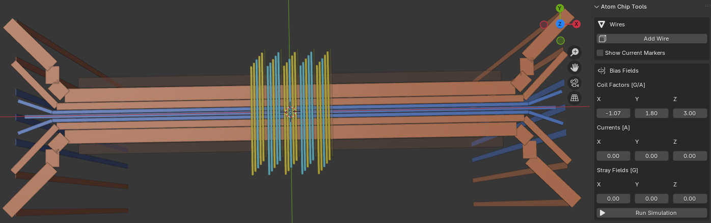

### 2D and 3D potential visualization

The framework includes tools to visualize the magnetic field and potential created by the atom chip wires in both 2D and 3D. This helps users understand how the wire configurations affect the trapping potentials for BECs.

<table width="100%">
<tr>
<td>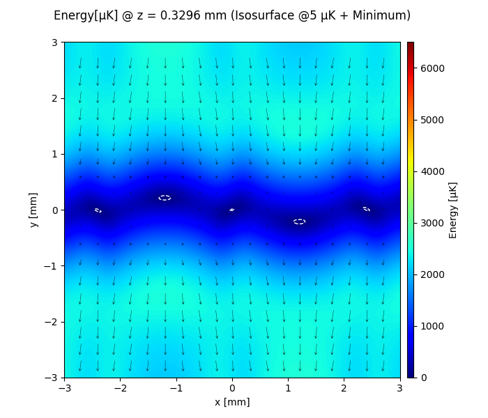</td>
<td>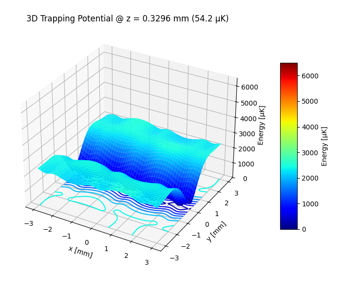</td>
</tr>
</table>

### Detailed trap analysis

The framework provides detailed analysis of the magnetic traps, including bias field parameters, trap frequencies, and potential minima. This information is crucial for understanding the trapping conditions for BECs.

```
Trap Analysis

Bias Field Parameters
----------------------------------------------------------------------------
Coil factors                [G/A] : [    -1.068        1.8          3]
Coil currents                 [A] : [         0          0          0]
Stray fields                  [G] : [         0          0          0]

Magnetic Field Minimum
----------------------------------------------------------------------------
Field Minimum                 [G] : 1.3090
Minimum Location             [mm] : [ 1.696e-07 -3.226e-06     0.3275]
Larmor frequency            [MHz] : 1.8321
Trap frequencies             [Hz] : [     111.4      347.3      364.5]

Hessian Eigenvalues and Eigenvectors:
[     76.25      740.9      816.3]
|    0.8988   0.002346    -0.4384|
|    0.4384  -0.004522     0.8987|
| 0.0001255         -1  -0.005093|

Trap Potential Minimum
----------------------------------------------------------------------------
Potential Minimum             [J] : 7.4879e-28
Minimum Location             [mm] : [ 1.097e-07 -3.142e-06     0.3296]
Larmor frequency            [MHz] : 1.8343
Trap frequencies             [Hz] : [     111.4      343.8      362.5]

Hessian Eigenvalues and Eigenvectors:
[  7.07e-26  6.733e-25  7.485e-25]
|    0.9011 -0.0006691    -0.4337|
|    0.4337  0.0008475     0.9011|
|-0.0002354         -1   0.001054|

BEC Parameters (Harmonic Oscillator Approximation)
----------------------------------------------------------------------------
HO Length a_ho               [μm] : 0.6957
Trap Frequency G-Avg w_ho [rad/s] : 1510.0088

Non-interacting           [atoms] : 100,000
Chemical Potential μ0         [J] : 2.7088e-31
Harmonic Oscillator Radii    [μm] : [     1.022     0.5816     0.5665]
Critical Temperature         [nK] : 503.2301

Thomas-Fermi              [atoms] : 100,000
Chemical Potential μ          [J] : 3.3182e-30
Harmonic Oscillator Radii    [μm] : [     9.689      3.139      2.978]
```

### Gradient-based optimization

The framework implements gradient-based optimization techniques to compute optimal current schedules for the atom chip wires. This allows for efficient transport of BECs while maintaining the desired trap geometry in simulated time.

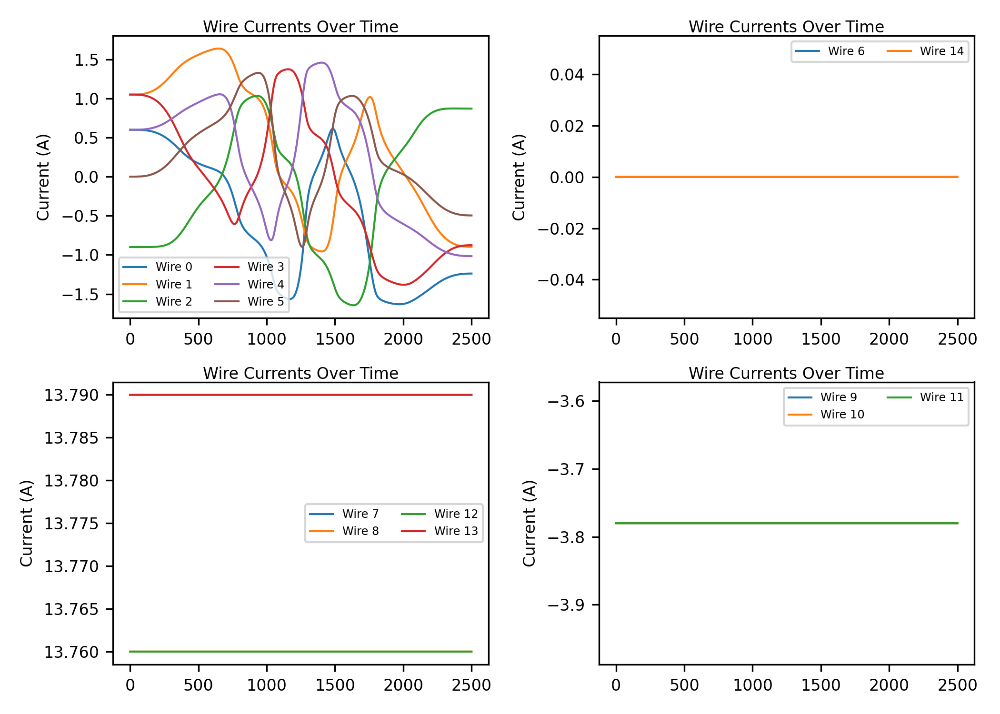

### Optimization result visualization

The framework provides detailed visualizations of the optimization results.

Optimized trap trajectory following a smoothstep schedule; lateral deviation < 10 μm.
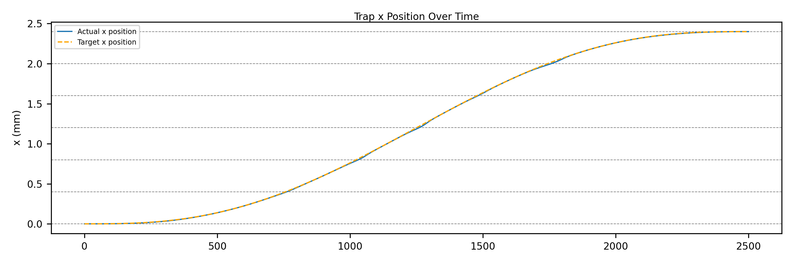
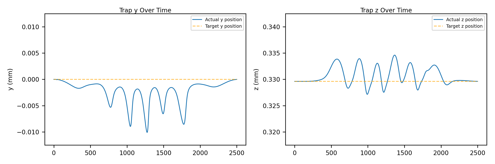
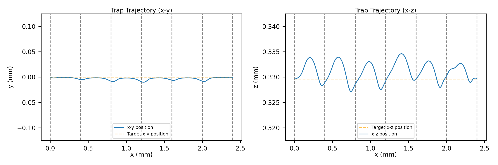

The speed of the transport in terms of the distance moved per time step is computed.
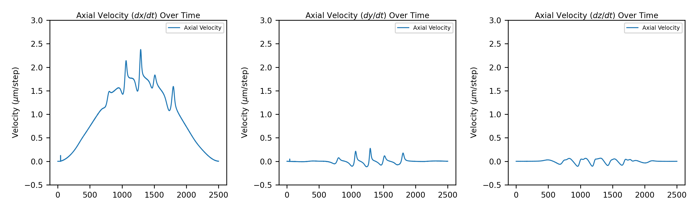

Trap frequencies and Thomas-Fermi radii are computed at each time step, providing insights into the dynamics of the BEC during transport.
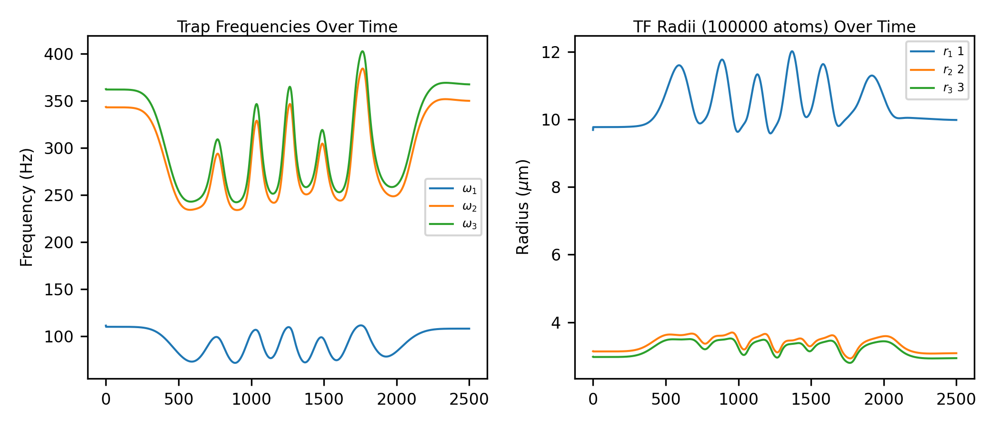

Potential minima and chemical potential are computed at each time step.
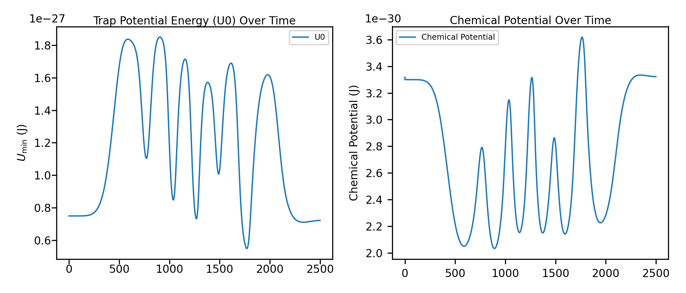

The framework also evaluates the speed vs adiabaticity trade-off, allowing users to assess the performance of the optimized current schedules in terms of speed and adiabaticity.
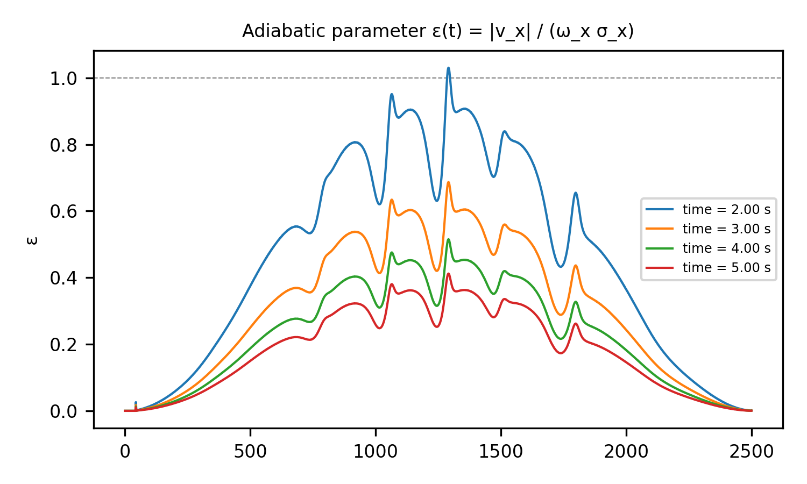</td>

## Installation

### 1. Clone the repository:

   ```bash
   git clone https://github.com/naokishibuya/atom-chip-optimizer.git
   cd atom-chip-optimizer
   ```

### 2. Set up a virtual environment:

   ```bash
   python3 -m venv .venv
   source .venv/bin/activate  # On macOS/Linux
   # .venv\Scripts\activate   # On Windows
   ```

### 3. Install dependencies:

   ```bash
   pip install --upgrade pip
   pip install -r requirements.txt
   ```

### 4. Install pre-commit hooks (Optional):

   ```bash
   pip install -r requirements-dev.txt  # Ruff, PyTest, etc.
   pre-commit install   # Install pre-commit hooks
   ```

## Demonstration

### Copper Z Trap

A demonstration of the framework is provided in the `src` directory. It includes a sample copper Z wire configuration and a script to run the optimization to find the potential minimum.

```bash
python src/copper_z.py
```

### Quadrupole Field

To demonstrate the quadrupole field, you can run:

```bash
python src/quadrupole_field.py
```

### BEC Transport Simulation

To show the initial transport simulation, run:

```bash
python src/transport_initializer.py
```

To run the optimization for the transport simulation, execute:

```bash
python src/transport_optimizer.py
```

This will create a folder under `results/[yyyymmdd_...]` with the optimized current schedules and other results.

To visualize the results that were generated, you can run:

```bash
python src/transport_reporter.py --results_dir results/[your_results_folder]
```

To visualize different scheduler curves, you can run:

```bash
python src/transport_scheduler.py
```

## Credit

This project is inspired by the work of the University of Sussex's BEC lab's MATLAB scripts.
